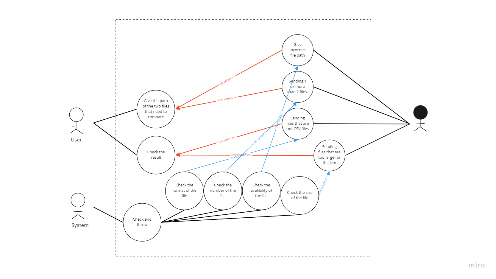

# Data Reconciliation

## Briefing

### Author

Gao Fancheng 1004879

### Description

Consider a CSV file that stores a list of records (e.g., records of bank accounts).
You are required to write a software program that reads two such CSV files, compares records
stored in these CSV files row by row against a unique combination and records all mismatches
as exceptions. Finally, the software program generates another csv file listing the exceptions.

### Example

Consider customer files that contain customer id, customer account number,
currency, account type (e.g., savings/current) and available balance. Compare available balance
against a unique combination of customer id, customer account number, account type and
currency. Generate a CSV file with records from both the files and corresponding to the
mismatched amount (i.e., balance) for the unique combination.

## User Diagram

[User Diagram](https://miro.com/app/board/uXjVO8LhsSg=/)

## Implementation

The major code is in src/main/java. 3 classes are employed to achieve different functions:

### ReadCSV.java
Contains one method readCsvByBufferedReader(String filePath). It takes the path of a csv file and try to read its lines and store in an ArrayList.
### Compare.java
Contains one method compare(String filepath1, String filepath2). It compares the content of two csv files and put the result into an ArrayList.
### WriteCSV.java
Contains one method writeToCSV(ArrayList<String> records,String fileName). It write the content of ArrayList into a csv file.
### Implementation Details
Change the following part in main.java to check your own csv files.
```Java
String filepath1 = "F:\\Term5\\50003\\Software Testing Mini Campaign\\sample_file_1.csv"; //The first csv file(The unique combination)
String filepath2 = "F:\\Term5\\50003\\Software Testing Mini Campaign\\sample_file_3.csv"; //The second csv file
String fileName = "F:\\Term5\\50003\\Software Testing Mini Campaign\\test1.csv"; //The result csv file
```
